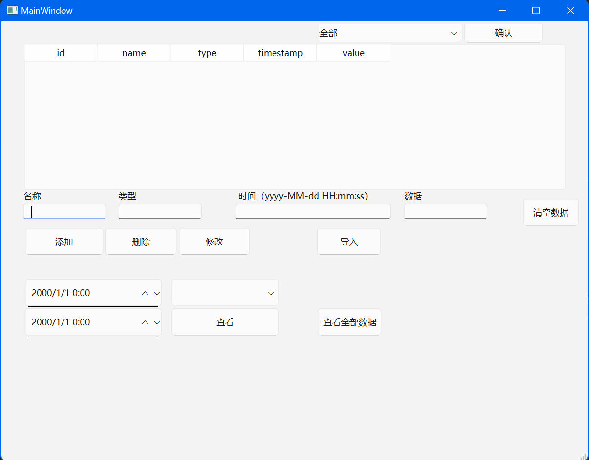

# 数据结构课设-传感器管理系统

`sensorSystem_mysql_template`和`sensorSystem_sqlite_template`均为模版

模版只实现了基本功能

可以自行扩展其他功能

已实现功能：

1.文本文件批量导入传感器数据

2.单个传感器信息的增删改

3.查看所有传感器数据的图像

4.选择时间段查看传感器数据的图像

5.在图像中标注数据最大值和最小值

6.清空所有数据

目前采用sqlite作为数据库
数据的批量导入较慢，对于十万级数据量，需要大概四五分钟的时间导入